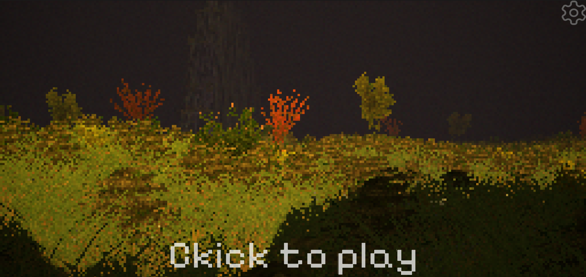
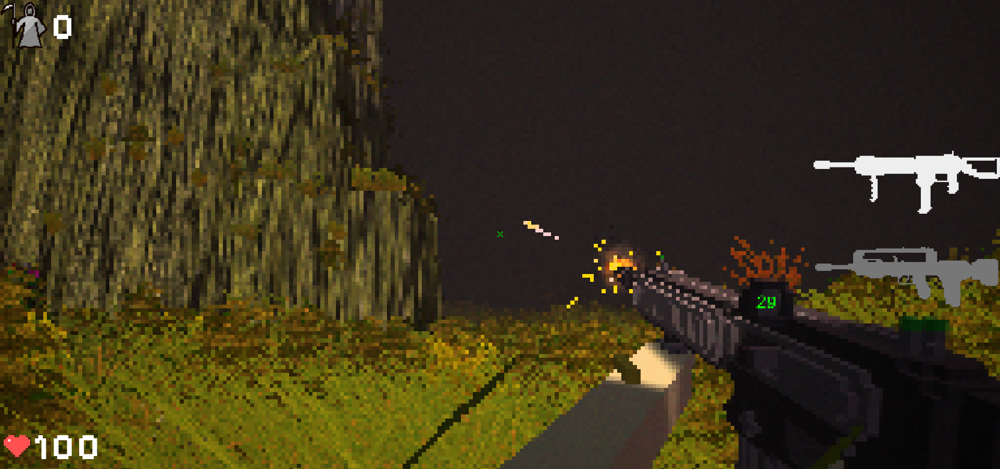
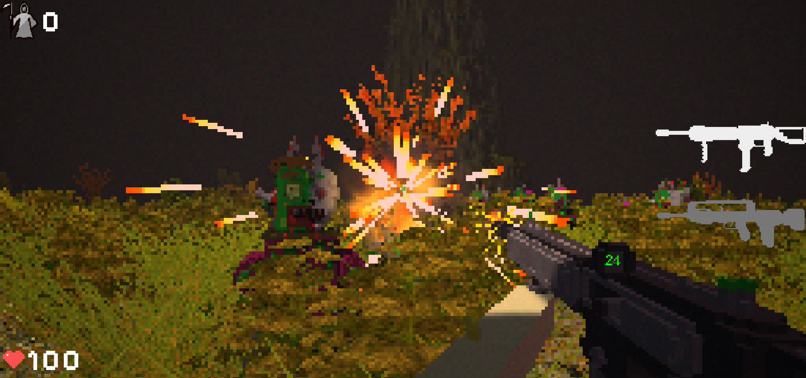
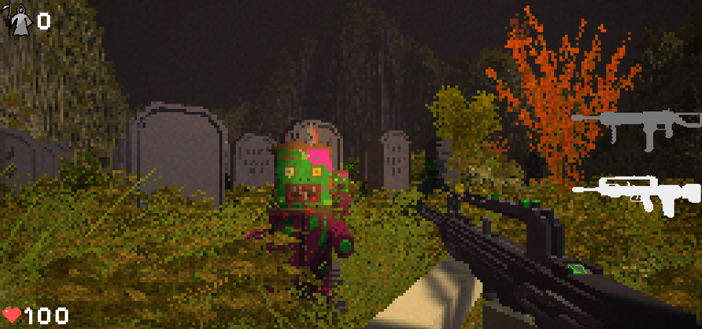
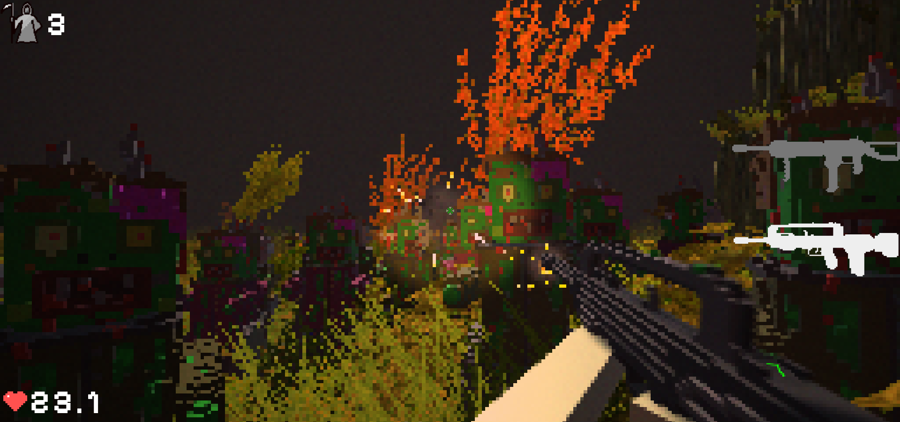
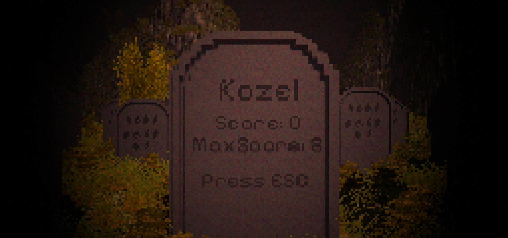

# `Project:` FPS Techno Demo

## `Navigation`

- [**Overview**](#overview)
- [**Screenshots**](#screenshots)
- [**About the Project**](#about-the-project)
    - [**Toolkit**](#toolkit)
- [**Plugins**](#plugins)
- [**Software Used**](#software-used)
- [**Future Plans**](#future-plans)
- [**Game Installation**](#game-installation)
- [**Outcome**](#outcome)
- [**Communication**](#communication)
- [**License**](#license)

## `Overview`
This project is a techno demo FPS game built with Unity. The architecture follows the MV pattern with a focus on strict OOP principles.

## [**Video gameplay**](https://youtu.be/fRHIoj7SJIo)

## `Screenshots`

  
View Screenshots

  
  
  
  
  
  

## `About the Project`
- **Architecture:** MV pattern with a focus on scalability and maintainability.
- **Coding Style:** Minimal use of MonoBehaviour classes for better modularity and testability.
- **Code Quality:** Thoroughly tested codebase, adhering to OOP principles for robust functionality.
- **Abstraction:** Unity-specific code is abstracted for clarity and ease of collaboration.

### Toolkit
The project includes a [Toolkit](FPS.Unity/Assets/_Project/Source/Toolkit) folder containing reusable components for various game systems. Future plans include turning this folder into a Unity package.

## `Plugins`
- **DoTween:** Animation engine for smooth transitions.
- **Odin Inspector:** Occasionally used for enhanced inspector functionality (careful due to potential build issues).
- **UniTask:** Simplifies asynchronous programming in Unity.
- **TextMeshPro:** High-performance text rendering.
- **NUnit:** Unit testing framework.
- **Addressables:** Efficient asset management (learning in progress).
- **Git lfs:** Extension for efficient versioning of large files. 

## `Software Used`
- **Unity:** Game development platform.
- **Rider:** IDE for C# and Unity development.
- **VS Code:** Lightweight code editor for quick edits.
- **Magica Voxel:** 3D voxel art creation.
- **Git:** Version control.
- **Figma:** UI editor.
- **Chat GPT:** AI-powered assistance for brainstorming and problem-solving.
- **Audacity:** Audio editing for immersive soundscapes.

## `Future Plans`
The roadmap includes:
- Refining gameplay mechanics for a more immersive experience.
- Expanding the [Toolkit](FPS.Unity/Assets/_Project/Source/Toolkit) with additional versatile components.
- Adding new mechanics, enemies, building creation elements, and an online leaderboard.

## `Game Installation`

1. Download archive [`Build.rar`](https://github.com/xXdatelXx/FPS/releases/latest)
2. Unpack it
3. Create a Shortcut on the desktop to the .exe file
4. Start this Shortcut

## `Outcome`
Completing the first stage of the project brought significant improvements:
- Enhanced understanding of OOP and its practical application.
- Advanced proficiency in C# and utilization of previously unfamiliar language constructs.
- Successful resolution of challenges that seemed insurmountable.
  
These acquired skills and knowledge will undoubtedly contribute to future projects, enabling the creation of even higher-quality and more scalable code.

## `Communication`
- **Telegram:** [@X_datel_X](https://t.me/X_datel_X) (preferably)
- **Email:** artemgurv@gmail.com

## `License`
This game is under the GNU General Public License.
